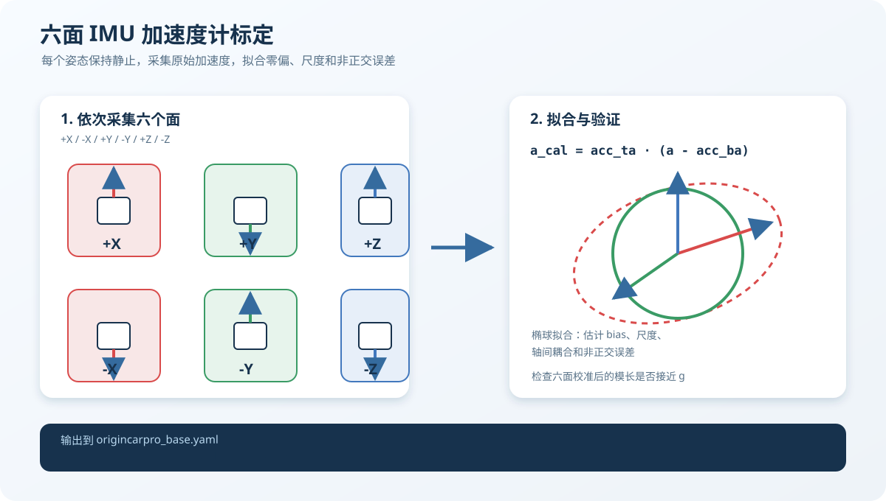

# 标定工具

这里放的是和导航直接相关的底盘、舵机和 IMU 标定工具。它们不启动真实车辆，输出的参数需要先离线检查，再在低速状态上车验证。

Python 依赖：

```bash
python3 -m pip install numpy pandas scipy openpyxl pyserial
```

## 舵机 PWM 与转角

比赛车的左右转向并不完全对称，不能只用一条直线或一个比例系数。做法是让舵机输出一组 PWM，在车模上逐点测量真实转角，左右两侧分别拟合单调 PCHIP 曲线：

```text
angle -> PWM       下位机执行命令
PWM   -> angle     离线分析、车模和有效转角估计
```

`fit_servo_pwm_angle_pchip.py` 接受测量 CSV 或原始 Excel 表，并导出两个方向的分段三次多项式。仓库里的 `data/servo_*_pwm_angle.csv` 是当前公开车模的测量均值，`stm32_ackermann_calibration.py` 和 `servo_fit.c` 是对应的运行时查表实现。

```bash
python3 tools/calibration/fit_servo_pwm_angle_pchip.py \
  --left tools/calibration/data/servo_left_pwm_angle.csv \
  --right tools/calibration/data/servo_right_pwm_angle.csv \
  --output /tmp/servo_fit

cc -std=c99 -Wall -Wextra -pedantic -c \
  tools/calibration/servo_fit.c -o /tmp/servo_fit.o
```

换舵机、舵机摇臂、下位机板子或车体结构以后，需要重新测中心 PWM、左右限幅和实际转角。转角标定会影响 Ackermann 曲率、`SmacPlannerHybrid` 的最小转弯半径、倒车 LUT、Tube 轨迹和 EKF 使用的底盘运动模型。

## IMU 六面法和陀螺零偏



`collect_imu_six_face.py` 可以直接从下位机串口采集六个面的原始数据，`filter_accel_samples.py` 先按重力模长和主轴方向筛掉明显异常帧。`calibrate_imu_six_face.py` 读取带有 `face,ax,ay,az` 列的静态样本 CSV，也兼容采集脚本使用的 `pose` 列。六个面分别标记为 `+x,-x,+y,-y,+z,-z`，默认用椭球仿射拟合得到完整的 `acc_ta` 和 `acc_ba`，这和 `origincarpro_base` 的配置形式一致：

```text
acc_calibrated = acc_ta @ (acc_measured - acc_ba)
```

如果只需要轴向偏置和尺度，可使用 `--model diagonal`。如果 CSV 是原始 LSB，可以用 `--accel-scale 16384 --gravity 1.0` 先在 g 单位下拟合；要复制到当前 `origincarpro_base.yaml`，建议使用车上对应的换算尺度，把样本先换算为 `m/s^2`，再运行工具。

```bash
python3 tools/calibration/calibrate_imu_six_face.py \
  --input six_face_samples.csv \
  --output /tmp/imu_calibration.yaml

python3 tools/calibration/collect_imu_six_face.py \
  --port /dev/ttyACM0 --baud 115200 \
  --duration 60 --output accel_6pose.csv

python3 tools/calibration/filter_accel_samples.py \
  --input accel_6pose.csv \
  --output accel_6pose_filtered.csv

python3 tools/calibration/estimate_gyro_bias.py \
  --input stationary_imu.csv \
  --output /tmp/gyro_bias.yaml

python3 tools/calibration/collect_gyro_bias.py \
  --port /dev/ttyACM0 --baud 115200 \
  --seconds 120 --output stationary_imu.csv
```

陀螺零偏应在车体完全静止时采集。启动时静止统计得到的 bias 和离线 bias 不能重复扣除；`gyro_bias`、启动零偏、死区和下位机强制清零逻辑要放在同一条数据链路里检查。

## 和导航调参的关系

标定顺序建议是：轮速方向和比例 → PWM/实际转角 → IMU 轴向、尺度和零偏 → EKF → 全局路径 → 局部跟踪与速度控制。标定不正确时，规划器看到的 Ackermann 车模和真实车不是同一辆车，继续调 MPPI 或 RPP 往往只是在补偿底层误差。
